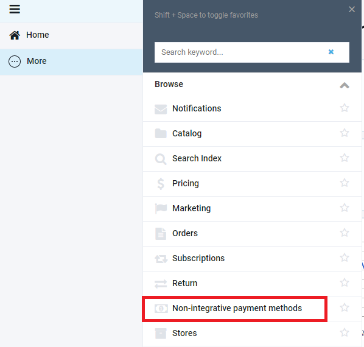
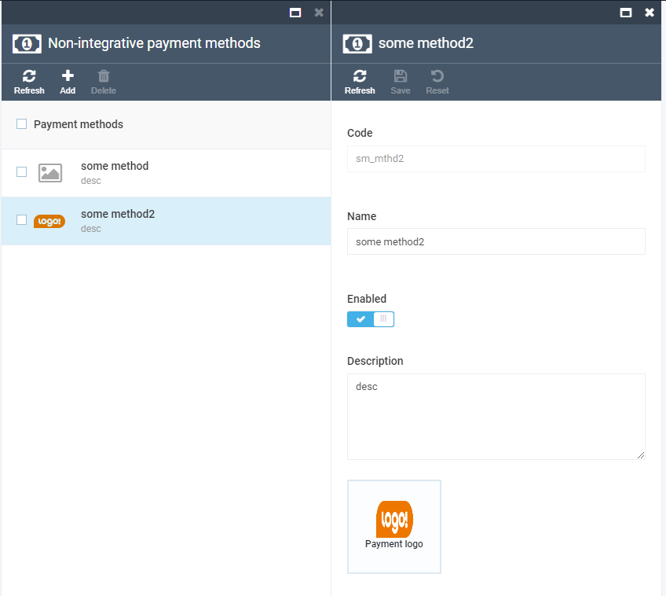
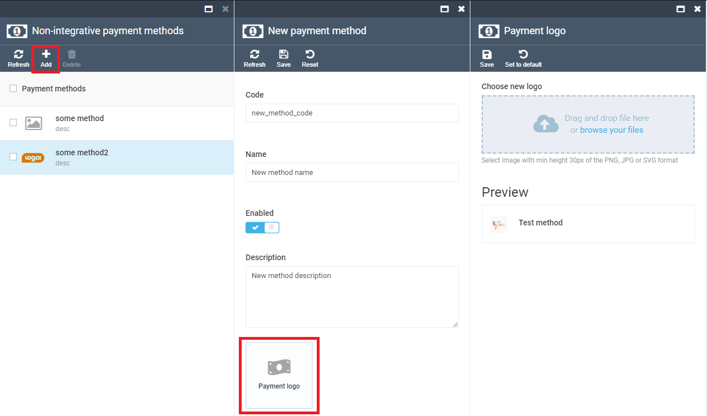
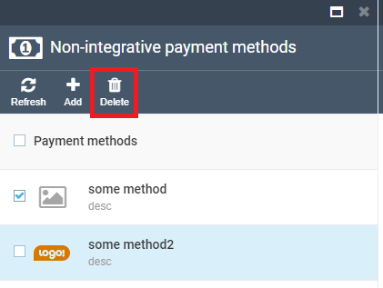

# Starting with non-integrative payment methdos
When module is intalled, you can find a corresponding menu item

# Managing non-integrative payment methods

## Viewing

Click on the menu item opens a blade with a created non-integrative payment methods list. Click on a methods opens a details blade.

## Creating

Click on the Add menu item above the list opens a blade for creating a payment method. Here you should provide values for the requireed fields Name and Code. Aslo by desire you can provide a description and change payment method logo by click on a widget below. Note that the code cannot be changed after the method is created, and codes must be unique not only among other non-integrative payment methods but amoung all payment methods existing in the system. Other payment methods can be found in the Store settings. 

Enable switch controls avaliability of the created method for stores: only the methods with the turned on switch will be available for stores.

## Deleting

Cheking at least one payment method in the list makes Delete button active. Click on it deletes selected methods.

