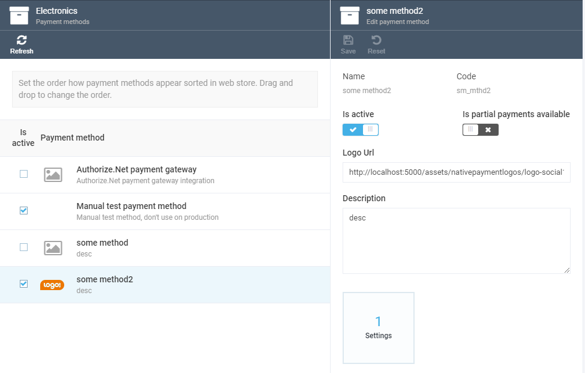

# Getting Started
Once you have installed the module, you will see the relevant menu item under the *...More* section:

# Managing Non-Integrative Payment Methods

## Viewing Payment Methods

Click on the menu item to open the screen with the non-integrative payment method list. To see the details, click the method in question:

## Creating New Payment Methods

Click the *Add* menu item above the list to open the *New Payment Method* screen. Here, you need to provide values for the required fields, *Name* and *Code*. Optionally, you can also provide a description and change the payment method logo by clicking the widget in the bottom part of the screen.

> Note: The code cannot be changed after the method has been created. Any code must be unique not only among other non-integrative payment methods, but also amoung all payment methods that exist in the system.

> Tip: You can find other payment methods in the store settings. 

Both the *Logo* widget and the *Description* text box provide default values of a payment method and can be overriden with different values for each store.

The *Enable* toggle makes the payment method in question available for stores only when it is on.

## Deleting Payment Methods

Selecting at least one payment method in the list makes the *Delete* button active. Click it to remove the selected method(s):

## Editing Payment Methods

You can edit any payment method by clicking it in the list. The editing process is the same as when you create a new methopd, except that the *Code* value cannot be changed.

# Using Payment Methods

## Managing for Stores

All non-integrative payment methods with the *Enabled* toggle on become avaliable for all stores:

Managing all kinds of payment methods is basically the same. You can enable a method for a store, switch partial payment setting, and change logo and description, which will override the default values:

## Getting via Experience API

All e-payment methods that are active for stores are also available in the shopping cart, no matter what kind of a method it is. Here is how the XAPI to get such methods looks like: 

